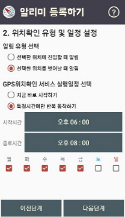

# 1. Introduce #
이 위치알리미 어플리케이션은 개인적인 안드로이드 사이드프로젝트 어플리케이션입니다.  
기본적으로 사용자가 설정한 위치에 진입하거나 벗어날 때 진동으로 알림을 알려줄 수 있습니다.
추가적으로 등록된 모바일 번호로 문자메시지(SMS)를 전송해 사용자가 설정한 위치에 진입했거나 벗어났다는 사실을 알려 줄 수 있습니다.

# 2. Screenshot #	

# 3. dependencies #
Play-service 의 **Maps SDK for Android API와 Places API** 를 사용합니다.  
[https://cloud.google.com/maps-platform/](https://cloud.google.com/maps-platform/ "https://cloud.google.com/maps-platform/")에 방문하여 API 키를 발급받습니다.
발급받은 키를 **src/debug/res/values, src/release/res/values 에 있는 google_maps_api.xml, google_place_api.xml** 에 각각 입력합니다.
  
**dependencies** {  
&nbsp;&nbsp;&nbsp;&nbsp;implementation 'com.android.support:appcompat-v7:26.1.0'  
&nbsp;&nbsp;&nbsp;&nbsp;implementation 'com.android.support:recyclerview-v7:26.1.0'  
&nbsp;&nbsp;&nbsp;&nbsp;implementation 'com.google.android.gms:play-services-maps:15.0.1'  
&nbsp;&nbsp;&nbsp;&nbsp;implementation 'com.google.android.gms:play-services-location:15.0.1'  
&nbsp;&nbsp;&nbsp;&nbsp;compile 'com.squareup.retrofit2:retrofit:2.1.0'  
&nbsp;&nbsp;&nbsp;&nbsp;compile 'com.squareup.retrofit2:converter-gson:2.1.0'  
&nbsp;&nbsp;&nbsp;&nbsp;compile 'com.getbase:floatingactionbutton:1.10.1'  
}

# 4. site #
[https://developside.tistory.com/67?category=641400](https://developside.tistory.com/67?category=641400 "https://developside.tistory.com/67?category=641400")